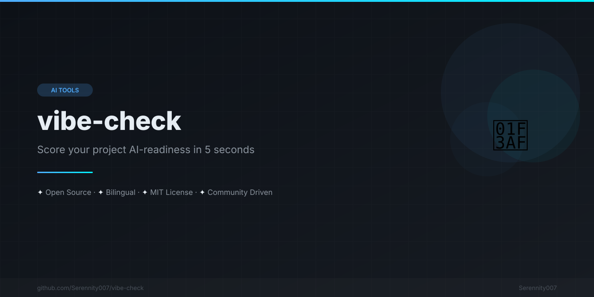

[English](README.md) | [中文](README.zh.md) | [日本語](README.ja.md) | [Français](README.fr.md) | [Español](README.es.md) | [العربية](README.ar.md) | [한국어](README.ko.md) | [Português](README.pt.md) | [Русский](README.ru.md) | [Deutsch](README.de.md)

<div align="center">



</div>


# 🎯 Vibe Check

<div align="center">

### `npx vibe-check` — 프로젝트가 AI 준비가 되었나요?

**프로젝트의 AI 코딩 어시스턴트 준비 상태를 즉시 점수로 확인하세요.**
명령어 하나. 설정 없음. 실행 가능한 결과.

[](https://www.npmjs.com/package/vibe-check)
[](https://www.npmjs.com/package/vibe-check)
[](LICENSE)

</div>

```bash
$ npx vibe-check

╔══════════════════════════════════════════════════════════════╗
║                    VIBE CHECK RESULTS                       ║
╚══════════════════════════════════════════════════════════════╝

╭────────────────────────────────────────────────────────────╮
│   ✨ Score: 83/100 | Grade: A                              │
│   Great! Your project is very AI-friendly.                 │
╰────────────────────────────────────────────────────────────╯

📊 Detailed Results:
  AI Rules Files [4/6]  20/26 points
  Documentation   [4/4]  15/15 points
  Type Safety     [2/3]   8/10 points
  Testing         [2/5]   6/6  points
  Code Quality    [3/4]   8/10 points
  Git & CI/CD     [3/4]   9/9  points
  Dependencies    [2/3]   4/8  points

💡 Recommendations:
  1. Add rules for more AI tools to maximize compatibility
  2. Add TypeScript type definitions (.d.ts files)
```

---

## 왜 Vibe Check인가요?

AI 코딩 어시스턴트(Cursor, Claude Code, Copilot, Kimi Code)는 프로젝트에 적절한 설정이 있을 때 **훨씬 더 좋은 코드**를 생성합니다 — 규칙 파일, TypeScript, 테스트, Linting. 하지만 대부분의 프로젝트는 이 중 절반이 빠져 있습니다.

**Vibe Check**는 몇 초 만에 프로젝트를 스캔하고 0-100 점수와 구체적인 추천을 제공합니다.

| 등급 | 점수 | 의미 |
|:----:|:----:|------|
| 🏆 S | 90–100 | 완벽 — 프로젝트가 골드 스탠다드 |
| ✨ A | 75–89 | 훌륭함 — 약간의 개선 가능 |
| 👍 B | 60–74 | 좋음 — 몇 가지 보완 필요 |
| 🔧 C | 40–59 | 보통 — 개선 여지 큼 |
| ⚠️ D | 20–39 | 개선 필요 — AI 어시스턴트 성능 저하 |
| ❌ F | 0–19 | 미흡 — 주요 설정 누락 |

---

## 빠른 시작

```bash
# No install required
npx vibe-check

# Check a specific project
npx vibe-check /path/to/project

# CI mode — fail the build if score < 70
npx vibe-check --min-score 70

# JSON output for scripts
npx vibe-check --json
```

---

## 검사 항목

7개 카테고리. **상호 배타적 검사**(예: ESLint 설정 형식)는 그룹화됩니다 — 가장 적합한 것만 카운트됩니다.

| 카테고리 | 최대 | 검사 항목 |
|----------|:----:|----------|
| 🤖 AI 규칙 | 26 | `.cursorrules`, `CLAUDE.md`, `AGENTS.md`, Copilot, Windsurf, Cline |
| 📚 문서 | 15 | `README`, `CONTRIBUTING`, `CHANGELOG`, `docs/` |
| 🔒 타입 안전성 | 10 | `tsconfig.json`, `types/`, `.d.ts` 파일 |
| 🧪 테스트 | 6 | Jest/Vitest/Mocha/Cypress/Playwright + 테스트 디렉토리 |
| ✨ 코드 품질 | 10 | ESLint + Prettier (모든 형식) + EditorConfig + Stylelint |
| 🔄 Git & CI/CD | 9 | GitHub Actions/GitLab CI + Husky + `.gitignore` |
| 📦 의존성 | 8 | 언어별 잠금 파일 (JS, Python, Rust, Go) |

**합계: 84점** → 0-100으로 정규화.

---

## 옵션

```
vibe-check [options] [directory]

Options:
  -j, --json             Output as JSON
  -v, --verbose          Show detailed per-check results
  -m, --min-score <N>    Exit code 1 if score < N (CI mode)
  --no-color             Disable colors
  -h, --help             Display help
  -V, --version          Display version
```

### CI 통합

```yaml
# GitHub Actions
- name: Check AI-friendliness
  run: npx vibe-check --min-score 60 --json
```

```yaml
# GitLab CI
vibe-check:
  script:
    - npx vibe-check --min-score 60
```

---

## 점수 향상 방법

```bash
# 1. Add AI rules (biggest impact — up to 26 points)
echo "# My Rules" > .cursorrules
echo "# My Rules" > CLAUDE.md

# 2. Add TypeScript (10 points)
npx tsc --init

# 3. Add ESLint + Prettier (10 points)
npm init @eslint/config
npm i -D prettier && echo {} > .prettierrc

# 4. Add a test framework (6 points)
npm i -D vitest

# 5. Add GitHub Actions CI (4 points)
mkdir -p .github/workflows
# create ci.yml

# 6. Add .gitignore (2 points)
npx gitignore node
```

---

## FAQ

**프로젝트를 수정하나요?**
아니요. Vibe-check는 100% 읽기 전용입니다.

**어떤 언어를 지원하나요?**
모든 언어. 모든 언어에서 작동하는 범용 도구(TypeScript, ESLint, 테스트, CI)를 검사합니다.

**CI에서 사용할 수 있나요?**
네! `npx vibe-check --min-score 70`은 점수가 임계값 미만이면 코드 1로 종료됩니다. PR 검사에 완벽합니다.

**예상보다 점수가 낮은 이유는?**
상호 배타적 항목이 그룹화됩니다. ESLint 설정 파일이 4개 있어도 1개보다 더 많은 점수를 얻지 못합니다 — 실제로 사용하는 형식만 카운트됩니다.

---

## 관련 프로젝트

| 프로젝트 | 설명 |
|---------|------|
| [**awesome-ai-rules**](https://github.com/liangzhengtao/awesome-ai-rules) | 20개 프로덕션 AI 코딩 규칙 |
| [**ai-commit**](https://github.com/liangzhengtao/ai-commit) | `npx ai-commit` — AI가 커밋 메시지를 작성 |
| [**awesome-mcp-servers**](https://github.com/liangzhengtao/awesome-mcp-servers) | Cursor, Claude Code, Kimi Code용 MCP 서버 |

## 기여하기

[CONTRIBUTING.md](CONTRIBUTING.md)를 참조하세요. PR 환영!

## 라이선스

[MIT](LICENSE)

---

<div align="center">

**유용했나요? ⭐를 눌러주세요**

</div>

---
